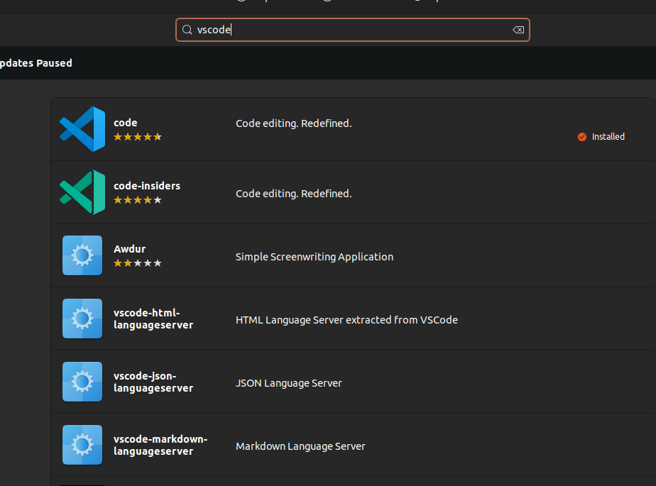
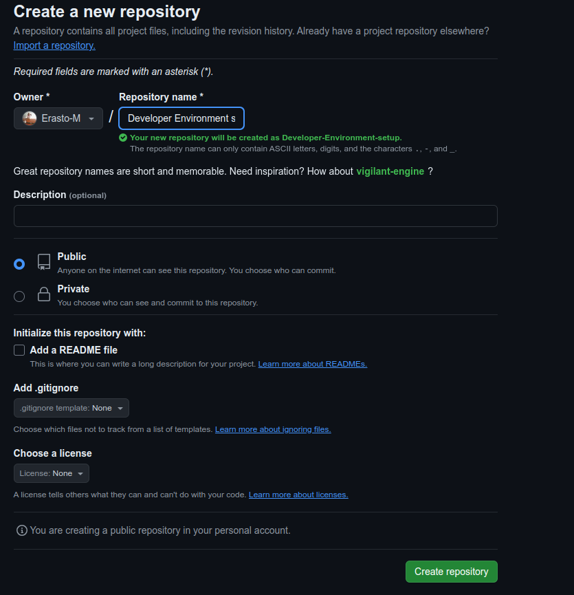
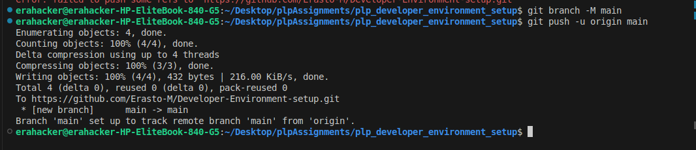

# Dev_Setup
Setup Development Environment

#Assignment: Setting Up Your Developer Environment

## PLP SOFTWARE ENGINEERING 
## Setting Up Developer Environment
1. Select Your Operating System (OS): Choose an operating system that best suits your preferences and project requirements. 
### Steps for downloading and Installing Ubuntu
### a. Check your System Requirements
- Ensure your computer meets the system requirements for Ubuntu:
- 2 GHz dual-core processor
- 4 GB RAM
- 25 GB of free hard drive space
## Backup your Data
- Backup all important data from your computer to avoid any loss during the installation process.
## Download Ubuntu
- Go to the Ubuntu Download Page.
- Click on "Download" to get the latest version of Ubuntu.

## Create installation Media
## Using Rufus (for Windows users):
- Download and install Rufus.
- Insert a USB flash drive (minimum 4 GB).
- Open Rufus and select the downloaded Ubuntu ISO file.
- Choose the USB flash drive as the destination and click "Start" to create the bootable USB drive.
## Using Balena Etcher (for macOS and Linux users):
- Download and install Balena Etcher.
- Insert a USB flash drive (minimum 4 GB).
- Open Etcher, select the downloaded Ubuntu ISO file, choose the USB flash drive as the destination, and click "Flash!" to create the bootable USB drive.

## In the above, select the Etcher for  linux

## Prepare your Personal Computer for Installation
- Insert the USB flash drive containing the Ubuntu installation media into your PC.
- Restart your computer.
- Enter the BIOS/UEFI settings (commonly accessed by pressing keys like F2, F12, Delete, or Esc during startup).
- Change the boot order to boot from the USB drive first.
## Install Ubuntu
- Boot from the USB drive and follow the installation instructions as shown in the screenshots below.

### Use wired connection in the case where you have an ethernet cable with internet connected to your pc

2. Install a Text Editor or Integrated Development Environment (IDE):
   Select and install a text editor or IDE suitable for your programming languages and workflow. Download and Install Visual Studio
   - In linux , you can download the vscode from the ubuntu software   or you can also use commands in the terminal

###  a. Open the ubuntu software

### b. Search for vscode in the ubuntu software 

### c. Click code then click install 

### d. It has successfully installed 

###  From the terminal it also shows that it is installed 

### Also from the desktop when I search 

### You can now open it to test . just use your terminal and open it
 

3. Set Up Version Control System:
   Install Git and configure it on your local machine. Create a GitHub account for hosting your repositories. Initialize a Git repository for your project and make your first commit. https://github.com
  ### a.  Run this command in the terminal to install git . and enter your password 

### b.  Check git version to confirm installation

### c. Create github account and create a new repository , enter the repository name , set it as either public or private depending on your needs

### d. Create a folder and open it in vscode , add files to it and then push to Github

### Open it in visual studio code and create two files and then initialize the github repository

### Add the files to tracking , make commits and finally push to the repository  you had created in github

### I faced some challenges ,  had not set the branch main to my local repository , that's why I set it after the second error 

4. Install Necessary Programming Languages and Runtimes:
  Instal Python from http://wwww.python.org programming language required for your project and install their respective compilers, interpreters, or runtimes. Ensure you have the necessary tools to build and execute your code.
  ## a. Install python in ubuntu using the terminal  and its respective installer 
  
  ###  Validate their Installation

###  c. Install Virtual environment using this command

### d. Validate its installation

5. Install Package Managers:
   If applicable, install package managers like pip (Python).
   ##  Already installed using the procedure above for installing python 
   
   

6. Configure a Database (MySQL):
   Download and install MySQL database. https://dev.mysql.com/downloads/windows/installer/5.7.html
   ### a. Install by  running this command   the terminal
   
   ### b. Configure MySQL Server:
   
During the installation process, you will be prompted to set a root password for MySQL. Choose a strong password and remember it.

    c. Secure MySQL Installation (Optional but Recommended):
            MySQL comes with a script to secure the installation. Run the following command and      follow the prompts to secure your MySQL installation:

7. Set Up Development Environments and Virtualization (Optional):
   Consider using virtualization tools like Docker or virtual machines to isolate project dependencies and ensure consistent environments across different machines.

8. Explore Extensions and Plugins:
   Explore available extensions, plugins, and add-ons for your chosen text editor or IDE to enhance functionality, such as syntax highlighting, linting, code formatting, and version control integration.

9. Document Your Setup:
    Create a comprehensive document outlining the steps you've taken to set up your developer environment. Include any configurations, customizations, or troubleshooting steps encountered during the process. 

#Deliverables:
- Document detailing the setup process with step-by-step instructions and screenshots where necessary.
- A GitHub repository containing a sample project initialized with Git and any necessary configuration files (e.g., .gitignore).
- A reflection on the challenges faced during setup and strategies employed to overcome them.

#Submission:
Submit your document and GitHub repository link through the designated platform or email to the instructor by the specified deadline.

#Evaluation Criteria:**
- Completeness and accuracy of setup documentation.
- Effectiveness of version control implementation.
- Appropriateness of tools selected for the project requirements.
- Clarity of reflection on challenges and solutions encountered.
- Adherence to submission guidelines and deadlines.

Note: Feel free to reach out for clarification or assistance with any aspect of the assignment.
